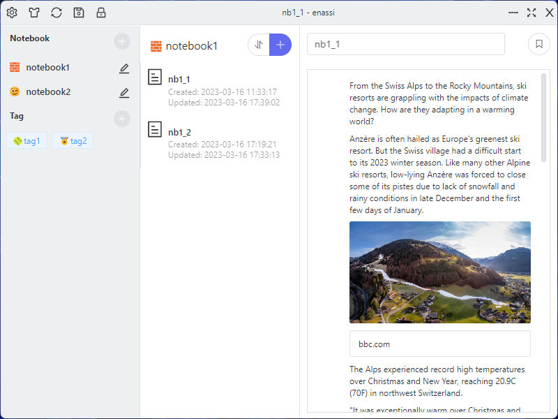

# enassi

> Note: So far, this project is still under development, and it is not recommended to store data now. Version 1.0 will be the first stable version, and the data synchronization function will be released in version 2.0

Enassi is an encryption assistant, your note and file will be encrypted.

- 💌 Free and open source
- 🌐 Multi-language support
- 🎨 Various themes
- 💻 Cross-platform
- 🙂 Easy to use
- 🔒 All data encryption(Support large file)

## Table of Contents

- [user manual](./docs/en/user_manual.md)
- [themes](./docs/en/themes.md)
- [develop](./docs/en/develop.md)
  - [file format](./docs/en/file_format.md)
  - [user data struct](./docs/en/user_data_struct.md)

## Product positioning 

- Personal private data storage.
- Do not actively access the network.
- License is [ENASSI DUAL License](./LICENSE)

## Screenshot

The following two screenshots are the **default** theme and **material** theme.

[More themes](./docs/en/themes.md)

  
  
&nbsp;

  

## Dante

[open collective](https://opencollective.com/enassi)

### Cryptocurrency

* XMR: 46df6rwnqcUCFaSummLobcH3J9sWgqYASF8Znq5HnhgrLeASh8u4TPJ2LaLnoQk3uV6t18CgNuFVCDfLUR9G94AZUj1TtGr
* SOL: BbrRkLArfTeAieAtDpvBHNE4KBKX9fmbjPb5JDmKHWE7
* ETH: 0xA59186a08424BE262FBacA922E87Ab82F3C5245B

### Platforms

Tauri currently supports development and distribution on the following platforms:

| Platform                 | Versions        |
| :----------------------- | :-------------- |
| Windows                  | 7 and above     |
| macOS                    | 10.15 and above |
| Linux                    | See below       |
| iOS/iPadOS (coming soon) |                 |
| Android (coming soon)    |                 |

#### Linux Support

- Arch
- Debian (Ubuntu 18.04 and above or equivalent)
- Fedora (latest 2 versions)

## Roadmap

[ ] list tag items

[ ] log

[ ] change master password

[ ] import / export note data

[ ] optimize the style of emoji-picker 

[ ] show editor outline

[ ] encryption and decryption of selected attachments

[ ] add more language

[ ] sync

[ ] add shortcut key 

[ ] support for custom css files

## FAQ

- Windows 10/11 missing emoji flag support
  - On Windows 10/11, we rely on Edge, currently render flags as letters, not flags. 
  - Firefox has fixed this using their own flag emoji.
  - [more](https://github.com/nolanlawson/emoji-picker-element/issues/269)

- Translation error found
  - Due to the use of automatic translation, there may be some problems, please feedback to us.