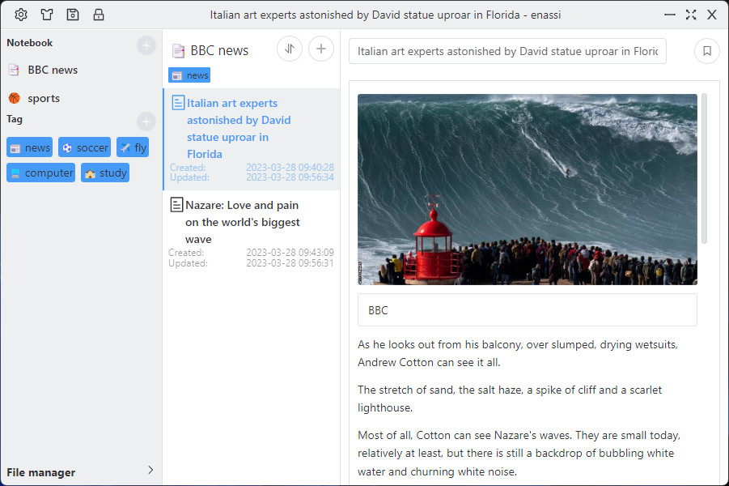
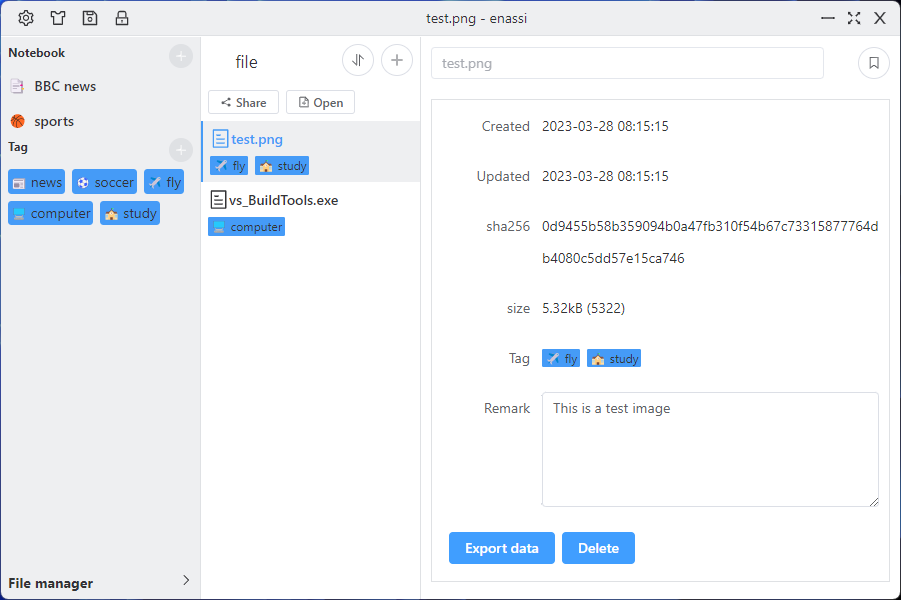

# User Manual

## Getting Started

Download and install the program, please set the necessary information in the setup wizard when you run it for the first time. The master password will be used to encrypt all your data, it is very important and can only be set once (the function of changing the master password will be provided in the future).

Editor function:

- Image: you can paste images into editor, it will be encoded as base64.

## Data directory

- The configure file is in your home directory `.enassi/conf.bin`, its content has been encrypted.
  - on Windows is: `C:\Users\YOUR_USER_NAME\.enassi\conf.bin`
  - on Linux is: `~/.enassi/conf.bin`
  - on MacOS is: `~/.enassi/conf.bin`

- The user data directory is set by yourself in `Setup wizard`.There will be several subdirectories in the working directory, and the directory names are encrypted.

## Desktop
### User Interface

#### Note:

#### File manager:

At the top, it is the title bar, when encrypt/decrypt big file,it also shows the progress.

There are some buttons on the top left corner in the above image:

- Setting button: Open `settings` dialog.
- Theme button: Change `theme`.
- Save button: `Save` right now.
- Lockscreen button: `Lockscreen` right now.

The main part of the app has navigation column / list column / editor column.

### Theme and appearance
We provide some built-in themes. Please click the **Theme** button to switch it.

### Set encryption

Open the `settings` dialog, click the **Encryption** tab.

This section is **very very very important**.

If you want to synchronize normally next time, you must fill in the same encryption settings.